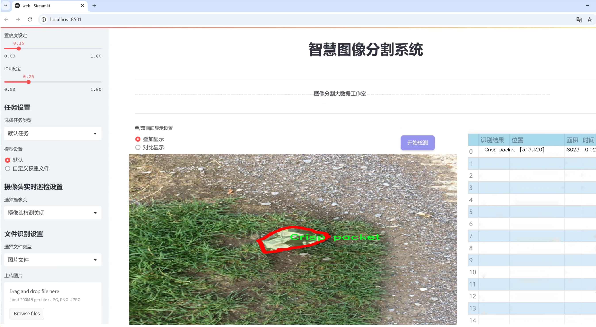
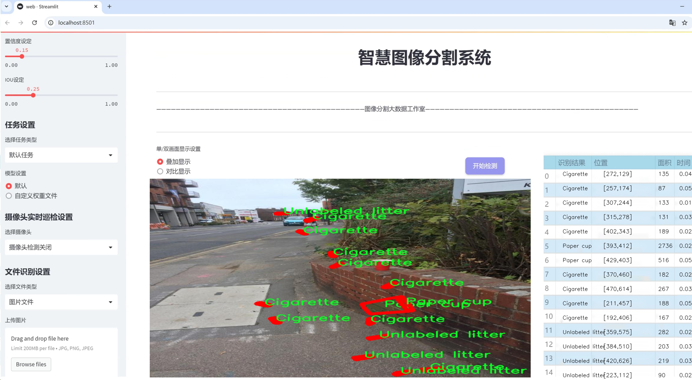
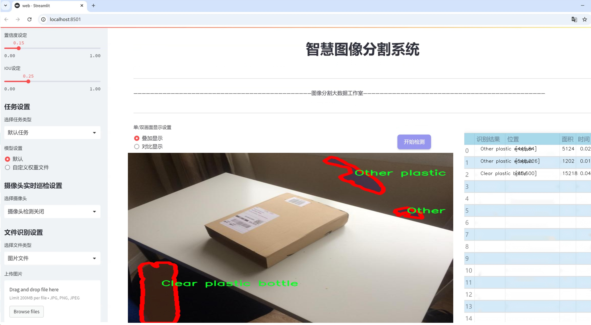
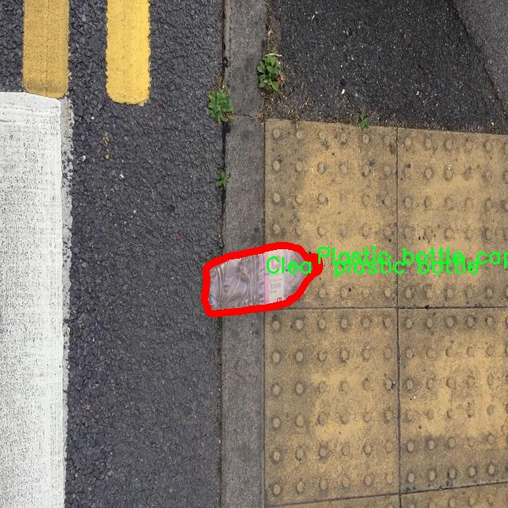
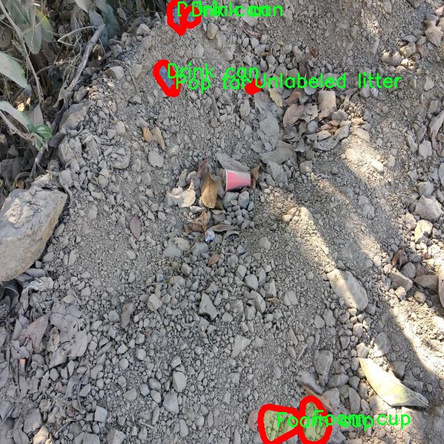
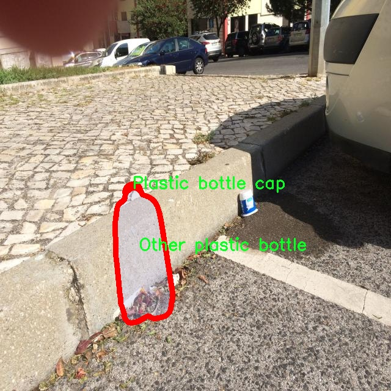
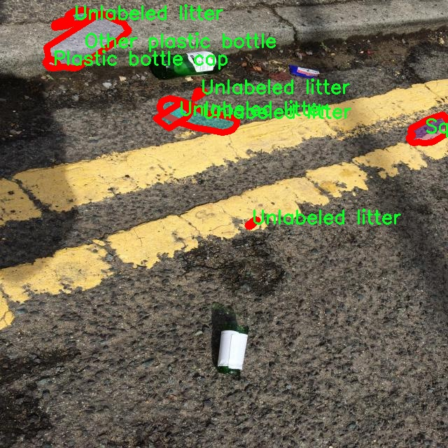
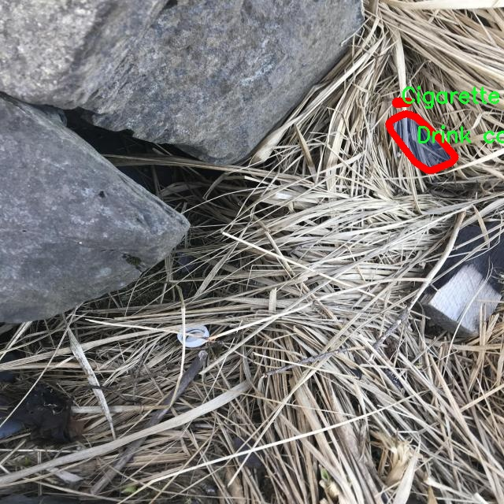

# 水下塑料垃圾分割系统源码＆数据集分享
 [yolov8-seg-C2f-RFAConv＆yolov8-seg-p2等50+全套改进创新点发刊_一键训练教程_Web前端展示]

### 1.研究背景与意义

项目参考[ILSVRC ImageNet Large Scale Visual Recognition Challenge](https://gitee.com/YOLOv8_YOLOv11_Segmentation_Studio/projects)

项目来源[AAAI Global Al lnnovation Contest](https://kdocs.cn/l/cszuIiCKVNis)

研究背景与意义

随着全球塑料污染问题的日益严重，尤其是在水域环境中，水下塑料垃圾的分类与处理已成为亟待解决的环境问题。根据联合国环境规划署的报告，全球每年产生的塑料垃圾高达3亿吨，其中相当一部分最终流入海洋和湖泊，严重影响水生生态系统和人类健康。因此，开发高效的水下塑料垃圾分割与分类系统显得尤为重要。传统的人工分类方法不仅耗时耗力，而且容易受到人为因素的影响，分类精度难以保证。为此，基于深度学习的图像处理技术，尤其是实例分割技术，提供了一种高效、自动化的解决方案。

在众多深度学习模型中，YOLO（You Only Look Once）系列因其实时性和高精度而备受关注。YOLOv8作为该系列的最新版本，具备了更强的特征提取能力和更快的处理速度，适合于复杂环境下的物体检测与分割。然而，水下环境的特殊性，如光线不足、色彩失真以及复杂的背景，给YOLOv8的应用带来了挑战。因此，改进YOLOv8以适应水下塑料垃圾的分割任务，具有重要的研究意义。

本研究将基于1500张图像的数据集，涵盖59类不同的水下塑料垃圾进行实例分割。这些类别不仅包括常见的塑料瓶、食品包装等，还涵盖了如铝箔、泡沫容器、纸质包装等多种材质的垃圾，体现了水下垃圾的多样性和复杂性。通过对这些数据的深入分析与处理，可以为改进YOLOv8提供丰富的训练样本，提升模型在水下环境中的适应性和准确性。

此外，水下塑料垃圾的分类与分割不仅对环境保护具有重要意义，也为后续的垃圾清理与资源回收提供了数据支持。通过精确的分类，可以帮助相关部门制定更为科学的垃圾处理方案，减少对水生生物的危害，促进可持续发展。因此，本研究不仅在学术上具有重要的理论价值，也在实际应用中展现出广泛的社会意义。

综上所述，基于改进YOLOv8的水下塑料垃圾分割系统的研究，不仅是对深度学习技术在环境保护领域应用的探索，也是对塑料污染问题解决方案的积极尝试。通过构建高效的分割系统，能够为水下塑料垃圾的管理与治理提供切实可行的技术支持，推动环境保护事业的发展。

### 2.图片演示







##### 注意：由于此博客编辑较早，上面“2.图片演示”和“3.视频演示”展示的系统图片或者视频可能为老版本，新版本在老版本的基础上升级如下：（实际效果以升级的新版本为准）

  （1）适配了YOLOV8的“目标检测”模型和“实例分割”模型，通过加载相应的权重（.pt）文件即可自适应加载模型。

  （2）支持“图片识别”、“视频识别”、“摄像头实时识别”三种识别模式。

  （3）支持“图片识别”、“视频识别”、“摄像头实时识别”三种识别结果保存导出，解决手动导出（容易卡顿出现爆内存）存在的问题，识别完自动保存结果并导出到tempDir中。

  （4）支持Web前端系统中的标题、背景图等自定义修改，后面提供修改教程。

  另外本项目提供训练的数据集和训练教程,暂不提供权重文件（best.pt）,需要您按照教程进行训练后实现图片演示和Web前端界面演示的效果。

### 3.视频演示

[3.1 视频演示](https://www.bilibili.com/video/BV1h3x9exEY2/)

### 4.数据集信息展示

##### 4.1 本项目数据集详细数据（类别数＆类别名）

nc: 59
names: ['Aerosol', 'Aluminium blister pack', 'Aluminium foil', 'Battery', 'Broken glass', 'Carded blister pack', 'Cigarette', 'Clear plastic bottle', 'Corrugated carton', 'Crisp packet', 'Disposable food container', 'Disposable plastic cup', 'Drink can', 'Drink carton', 'Egg carton', 'Foam cup', 'Foam food container', 'Food Can', 'Food waste', 'Garbage bag', 'Glass bottle', 'Glass cup', 'Glass jar', 'Magazine paper', 'Meal carton', 'Metal bottle cap', 'Metal lid', 'Normal paper', 'Other carton', 'Other plastic', 'Other plastic bottle', 'Other plastic container', 'Other plastic cup', 'Other plastic wrapper', 'Paper bag', 'Paper cup', 'Paper straw', 'Pizza box', 'Plastic bottle cap', 'Plastic film', 'Plastic glooves', 'Plastic lid', 'Plastic straw', 'Plastic utensils', 'Polypropylene bag', 'Pop tab', 'Rope - strings', 'Scrap metal', 'Shoe', 'Single-use carrier bag', 'Six pack rings', 'Spread tub', 'Squeezable tube', 'Styrofoam piece', 'Tissues', 'Toilet tube', 'Tupperware', 'Unlabeled litter', 'Wrapping paper']


##### 4.2 本项目数据集信息介绍

数据集信息展示

在当前全球环境保护日益受到重视的背景下，针对水下塑料垃圾的监测与处理显得尤为重要。本研究所使用的数据集名为“Underwater Plastic Classification”，其主要目的是为改进YOLOv8-seg的水下塑料垃圾分割系统提供支持。该数据集包含59个类别，涵盖了多种常见的水下塑料垃圾和其他相关物品，为模型的训练和测试提供了丰富的样本。

数据集中包含的类别包括从日常生活中常见的塑料制品到一些特殊的垃圾类型，具体类别列表如下：气雾剂、铝制药品包装、铝箔、电池、破碎玻璃、卡装药品包装、香烟、透明塑料瓶、瓦楞纸箱、脆片包装、一次性食品容器、一次性塑料杯、饮料罐、饮料纸箱、蛋盒、泡沫杯、泡沫食品容器、食品罐、食品垃圾、垃圾袋、玻璃瓶、玻璃杯、玻璃罐、杂志纸、餐盒、金属瓶盖、金属盖、普通纸、其他纸箱、其他塑料、其他塑料瓶、其他塑料容器、其他塑料杯、其他塑料包装、纸袋、纸杯、纸吸管、比萨盒、塑料瓶盖、塑料薄膜、塑料手套、塑料盖、塑料吸管、塑料餐具、聚丙烯袋、拉环、绳索和线、废金属、鞋子、一次性购物袋、六个装环、涂抹容器、可挤压管、泡沫塑料片、纸巾、卫生纸管、保鲜盒、未标记垃圾和包装纸等。

这一数据集的多样性使其在水下塑料垃圾识别和分类任务中具有极高的实用价值。每个类别都代表了在水下环境中可能遇到的不同类型的垃圾，这不仅包括塑料制品，还涵盖了其他材质的垃圾，反映了水下环境的复杂性和多样性。通过对这些类别的精确分类，研究人员能够更好地理解水下塑料垃圾的组成，从而为后续的清理和管理工作提供数据支持。

在数据集的构建过程中，研究团队注重数据的准确性和代表性，确保每个类别都有足够的样本量，以便于模型的有效训练。此外，数据集还考虑到了不同水下环境的特征，确保模型能够在各种情况下进行有效的垃圾识别和分割。这一数据集的设计理念不仅是为了提高YOLOv8-seg模型的性能，更是希望能够为未来的水下垃圾清理工作提供科学依据和技术支持。

总之，“Underwater Plastic Classification”数据集的构建为水下塑料垃圾的自动识别与分类提供了坚实的基础。通过对59个类别的细致划分和丰富样本的提供，研究人员能够在训练改进YOLOv8-seg模型的过程中，充分利用这些数据，从而提升模型在实际应用中的准确性和可靠性。这一数据集的应用不仅有助于推动水下环境保护技术的发展，也为未来的研究提供了宝贵的资源。











### 5.全套项目环境部署视频教程（零基础手把手教学）

[5.1 环境部署教程链接（零基础手把手教学）](https://www.bilibili.com/video/BV1jG4Ve4E9t/?vd_source=bc9aec86d164b67a7004b996143742dc)


[5.2 安装Python虚拟环境创建和依赖库安装视频教程链接（零基础手把手教学）](https://www.bilibili.com/video/BV1nA4VeYEze/?vd_source=bc9aec86d164b67a7004b996143742dc)

### 6.手把手YOLOV8-seg训练视频教程（零基础小白有手就能学会）

[6.1 手把手YOLOV8-seg训练视频教程（零基础小白有手就能学会）](https://www.bilibili.com/video/BV1cA4VeYETe/?vd_source=bc9aec86d164b67a7004b996143742dc)


按照上面的训练视频教程链接加载项目提供的数据集，运行train.py即可开始训练



     Epoch   gpu_mem       box       obj       cls    labels  img_size
     1/200     0G   0.01576   0.01955  0.007536        22      1280: 100%|██████████| 849/849 [14:42<00:00,  1.04s/it]
               Class     Images     Labels          P          R     mAP@.5 mAP@.5:.95: 100%|██████████| 213/213 [01:14<00:00,  2.87it/s]
                 all       3395      17314      0.994      0.957      0.0957      0.0843

     Epoch   gpu_mem       box       obj       cls    labels  img_size
     2/200     0G   0.01578   0.01923  0.007006        22      1280: 100%|██████████| 849/849 [14:44<00:00,  1.04s/it]
               Class     Images     Labels          P          R     mAP@.5 mAP@.5:.95: 100%|██████████| 213/213 [01:12<00:00,  2.95it/s]
                 all       3395      17314      0.996      0.956      0.0957      0.0845

     Epoch   gpu_mem       box       obj       cls    labels  img_size
     3/200     0G   0.01561    0.0191  0.006895        27      1280: 100%|██████████| 849/849 [10:56<00:00,  1.29it/s]
               Class     Images     Labels          P          R     mAP@.5 mAP@.5:.95: 100%|███████   | 187/213 [00:52<00:00,  4.04it/s]
                 all       3395      17314      0.996      0.957      0.0957      0.0845


### 7.50+种全套YOLOV8-seg创新点代码加载调参视频教程（一键加载写好的改进模型的配置文件）

[7.1 50+种全套YOLOV8-seg创新点代码加载调参视频教程（一键加载写好的改进模型的配置文件）](https://www.bilibili.com/video/BV1Hw4VePEXv/?vd_source=bc9aec86d164b67a7004b996143742dc)

### 8.YOLOV8-seg图像分割算法原理

原始YOLOv8-seg算法原理

YOLOv8-seg作为YOLO系列的最新版本，代表了目标检测和图像分割领域的一次重要进步。其设计理念不仅强调了高效性和准确性，还注重了模型的灵活性和适应性。YOLOv8-seg的架构主要由输入层、主干网络、颈部网络和头部网络四个核心组件构成，这些组件共同协作，以实现对图像中目标的精确检测和分割。

在输入层，YOLOv8-seg采用了一种自适应的图像缩放策略，以确保输入图像能够满足指定的尺寸要求。该方法通过将图像的长边缩放到预设的640像素，同时对短边进行填充，从而最大限度地减少信息的冗余。这种处理方式不仅提升了模型的推理速度，还确保了目标在图像中的清晰度和可辨识性。此外，YOLOv8-seg在训练阶段引入了Mosaic数据增强技术，通过随机拼接多张图像，增强了模型对不同背景和目标位置的适应能力，从而有效提高了模型的泛化性能。

主干网络是YOLOv8-seg的核心部分，其设计灵感来源于YOLOv7中的E-ELAN结构。主干网络通过一系列卷积操作对输入图像进行下采样，提取出丰富的特征信息。每个卷积层均配备了批归一化和SiLU激活函数，以提高模型的收敛速度和性能。特别地，YOLOv8-seg引入了C2f模块，这一模块通过跨层分支连接，增强了模型的梯度流动性，从而有效改善了检测结果的准确性。在主干网络的末尾，SPPFl模块通过三个最大池化层处理多尺度特征，进一步提升了网络的特征抽象能力，使得模型能够更好地应对复杂的场景和多样的目标。

颈部网络则在特征融合方面发挥了重要作用。YOLOv8-seg采用了FPNS（Feature Pyramid Network）和PAN（Path Aggregation Network）结构，旨在融合来自不同尺度的特征图信息。这一过程通过上采样和下采样操作，确保了不同层次特征的有效整合，使得模型在处理小目标时具备更强的感知能力。颈部网络的设计不仅提升了特征的多样性，还为后续的检测和分割任务提供了更为丰富的信息基础。

在头部网络中，YOLOv8-seg引入了解耦的检测头结构，这一创新使得分类和回归过程得以独立进行。具体而言，头部网络通过两个并行的卷积分支分别计算目标的类别和位置回归损失。这种解耦设计有效减少了不同任务之间的干扰，提高了模型的整体性能。此外，YOLOv8-seg在损失计算方面采用了BCE（Binary Cross-Entropy）损失函数用于分类任务，而在回归任务中则使用了DFL（Distribution Focal Loss）和CIoU（Complete Intersection over Union）损失函数，以增强模型对目标边界的精确定位能力。

值得注意的是，YOLOv8-seg摒弃了传统的anchor-based检测方法，转而采用了anchor-free的策略。这一转变使得模型在处理不同尺度和形状的目标时，能够更加灵活和高效。通过将目标检测转化为关键点检测，YOLOv8-seg避免了在训练前对锚框进行预设的复杂过程，从而提升了模型的泛化能力和简洁性。

尽管YOLOv8-seg在许多方面展现了出色的性能，但在复杂水面环境下的应用仍面临挑战。小目标漂浮物的特征复杂多变，背景的多样性使得模型在定位和感知能力上存在一定的不足。为了解决这些问题，研究者们提出了YOLOv8-WSSOD算法，旨在通过引入BiFormer双层路由注意力机制、优化检测头以及改进损失函数等方式，进一步提升YOLOv8-seg在特定场景下的表现。

总的来说，YOLOv8-seg算法通过其独特的网络结构和创新的设计理念，为目标检测和图像分割任务提供了强有力的工具。其在特征提取、特征融合和任务解耦等方面的改进，使得YOLOv8-seg在准确性和效率上均表现出色，成为了当前计算机视觉领域的重要里程碑。随着技术的不断进步，YOLOv8-seg及其衍生算法将在更广泛的应用场景中发挥重要作用，推动目标检测和图像分割技术的进一步发展。


### 9.系统功能展示（检测对象为举例，实际内容以本项目数据集为准）

图9.1.系统支持检测结果表格显示

  图9.2.系统支持置信度和IOU阈值手动调节

  图9.3.系统支持自定义加载权重文件best.pt(需要你通过步骤5中训练获得)

  图9.4.系统支持摄像头实时识别

  图9.5.系统支持图片识别

  图9.6.系统支持视频识别

  图9.7.系统支持识别结果文件自动保存

  图9.8.系统支持Excel导出检测结果数据


### 10.50+种全套YOLOV8-seg创新点原理讲解（非科班也可以轻松写刊发刊，V11版本正在科研待更新）

#### 10.1 由于篇幅限制，每个创新点的具体原理讲解就不一一展开，具体见下列网址中的创新点对应子项目的技术原理博客网址【Blog】：


[10.1 50+种全套YOLOV8-seg创新点原理讲解链接](https://gitee.com/qunmasj/good)

#### 10.2 部分改进模块原理讲解(完整的改进原理见上图和技术博客链接)

### Gold-YOLO简介
YOLO再升级：华为诺亚提出Gold-YOLO，聚集-分发机制打造新SOTA
在过去的几年中，YOLO系列模型已经成为实时目标检测领域的领先方法。许多研究通过修改架构、增加数据和设计新的损失函数，将基线推向了更高的水平。然而以前的模型仍然存在信息融合问题，尽管特征金字塔网络（FPN）和路径聚合网络（PANet）已经在一定程度上缓解了这个问题。因此，本研究提出了一种先进的聚集和分发机制（GD机制），该机制通过卷积和自注意力操作实现。这种新设计的模型被称为Gold-YOLO，它提升了多尺度特征融合能力，在所有模型尺度上实现了延迟和准确性的理想平衡。此外，本文首次在YOLO系列中实现了MAE风格的预训练，使得YOLO系列模型能够从无监督预训练中受益。Gold-YOLO-N在COCO val2017数据集上实现了出色的39.9% AP，并在T4 GPU上实现了1030 FPS，超过了之前的SOTA模型YOLOv6-3.0-N，其FPS相似，但性能提升了2.4%。


#### Gold-YOLO


YOLO系列的中间层结构采用了传统的FPN结构，其中包含多个分支用于多尺度特征融合。然而，它只充分融合来自相邻级别的特征，对于其他层次的信息只能间接地进行“递归”获取。

传统的FPN结构在信息传输过程中存在丢失大量信息的问题。这是因为层之间的信息交互仅限于中间层选择的信息，未被选择的信息在传输过程中被丢弃。这种情况导致某个Level的信息只能充分辅助相邻层，而对其他全局层的帮助较弱。因此，整体上信息融合的有效性可能受到限制。
为了避免在传输过程中丢失信息，本文采用了一种新颖的“聚集和分发”机制（GD），放弃了原始的递归方法。该机制使用一个统一的模块来收集和融合所有Level的信息，并将其分发到不同的Level。通过这种方式，作者不仅避免了传统FPN结构固有的信息丢失问题，还增强了中间层的部分信息融合能力，而且并没有显著增加延迟。


# 8.低阶聚合和分发分支 Low-stage gather-and-distribute branch
从主干网络中选择输出的B2、B3、B4、B5特征进行融合，以获取保留小目标信息的高分辨率特征。


低阶特征对齐模块 (Low-stage feature alignment module)： 在低阶特征对齐模块（Low-FAM）中，采用平均池化（AvgPool）操作对输入特征进行下采样，以实现统一的大小。通过将特征调整为组中最小的特征大小（ R B 4 = 1 / 4 R ） （R_{B4} = 1/4R）（R 
B4 =1/4R），我们得到对齐后的特征F a l i g n F_{align}F align 。低阶特征对齐技术确保了信息的高效聚合，同时通过变换器模块来最小化后续处理的计算复杂性。其中选择 R B 4 R_{B4}R B4 作为特征对齐的目标大小主要基于保留更多的低层信息的同时不会带来较大的计算延迟。
低阶信息融合模块(Low-stage information fusion module)： 低阶信息融合模块（Low-IFM）设计包括多层重新参数化卷积块（RepBlock）和分裂操作。具体而言，RepBlock以F a l i g n ( c h a n n e l = s u m ( C B 2 ， C B 3 ， C B 4 ， C B 5 ) ) F_{align} (channel= sum(C_{B2}，C_{B3}，C_{B4}，C_{B5}))F align (channel=sum(C B2 ，C B3 ，C B4 ，C B5 )作为输入，并生成F f u s e ( c h a n n e l = C B 4 + C B 5 ) F_{fuse} (channel= C_{B4} + C_{B5})F fuse (channel=C B4 +C B5 )。其中中间通道是一个可调整的值（例如256），以适应不同的模型大小。由RepBlock生成的特征随后在通道维度上分裂为F i n j P 3 Finj_P3Finj P 3和F i n j P 4 Finj_P4Finj P 4，然后与不同级别的特征进行融合。


# 8.高阶聚合和分发分支 High-stage gather-and-distribute branch
高级全局特征对齐模块（High-GD）将由低级全局特征对齐模块（Low-GD）生成的特征{P3, P4, P5}进行融合。


高级特征对齐模块(High-stage feature alignment module)： High-FAM由avgpool组成，用于将输入特征的维度减小到统一的尺寸。具体而言，当输入特征的尺寸为{R P 3 R_{P3}R P3 , R P 4 R_{P4}R P4 , R P 5 R_{P 5}R P5 }时，avgpool将特征尺寸减小到该特征组中最小的尺寸（R P 5 R_{P5}R P5  = 1/8R）。由于transformer模块提取了高层次的信息，池化操作有助于信息聚合，同时降低了transformer模块后续步骤的计算需求。

Transformer融合模块由多个堆叠的transformer组成，transformer块的数量为L。每个transformer块包括一个多头注意力块、一个前馈网络（FFN）和残差连接。采用与LeViT相同的设置来配置多头注意力块，使用16个通道作为键K和查询Q的头维度，32个通道作为值V的头维度。为了加速推理过程，将层归一化操作替换为批归一化，并将所有的GELU激活函数替换为ReLU。为了增强变换器块的局部连接，在两个1x1卷积层之间添加了一个深度卷积层。同时，将FFN的扩展因子设置为2，以在速度和计算成本之间取得平衡。

信息注入模块(Information injection module)： 高级全局特征对齐模块（High-GD）中的信息注入模块与低级全局特征对齐模块（Low-GD）中的相同。在高级阶段，局部特征（Flocal）等于Pi，因此公式如下所示：


### 增强的跨层信息流动 Enhanced cross-layer information flow
为了进一步提升性能，从YOLOv8 中的PAFPN模块中得到启发，引入了Inject-LAF模块。该模块是注入模块的增强版，包括了一个轻量级相邻层融合（LAF）模块，该模块被添加到注入模块的输入位置。为了在速度和准确性之间取得平衡，设计了两个LAF模型：LAF低级模型和LAF高级模型，分别用于低级注入（合并相邻两层的特征）和高级注入（合并相邻一层的特征）。它们的结构如图5(b)所示。为了确保来自不同层级的特征图与目标大小对齐，在实现中的两个LAF模型仅使用了三个操作符：双线性插值（上采样过小的特征）、平均池化（下采样过大的特征）和1x1卷积（调整与目标通道不同的特征）。模型中的LAF模块与信息注入模块的结合有效地平衡了准确性和速度之间的关系。通过使用简化的操作，能够增加不同层级之间的信息流路径数量，从而提高性能而不显著增加延迟。


### 11.项目核心源码讲解（再也不用担心看不懂代码逻辑）

#### 11.1 ui.py

以下是经过简化和注释的核心代码：

```python
import sys
import subprocess
from QtFusion.path import abs_path

def run_script(script_path):
    """
    使用当前 Python 环境运行指定的脚本。

    Args:
        script_path (str): 要运行的脚本路径
    """
    # 获取当前 Python 解释器的路径
    python_path = sys.executable

    # 构建运行命令，使用 streamlit 运行指定的脚本
    command = f'"{python_path}" -m streamlit run "{script_path}"'

    # 执行命令并等待其完成
    result = subprocess.run(command, shell=True)
    
    # 检查命令执行结果，如果返回码不为0，则表示出错
    if result.returncode != 0:
        print("脚本运行出错。")

# 主程序入口
if __name__ == "__main__":
    # 获取脚本的绝对路径
    script_path = abs_path("web.py")

    # 运行指定的脚本
    run_script(script_path)
```

### 代码分析与注释：

1. **导入模块**：
   - `sys`：用于访问与 Python 解释器相关的变量和函数。
   - `subprocess`：用于创建新进程、连接到它们的输入/输出/错误管道，并获得返回码。
   - `abs_path`：从 `QtFusion.path` 导入的函数，用于获取文件的绝对路径。

2. **`run_script` 函数**：
   - 该函数接受一个脚本路径作为参数，并使用当前 Python 环境运行该脚本。
   - 使用 `sys.executable` 获取当前 Python 解释器的路径，以确保使用正确的 Python 版本。
   - 构建一个命令字符串，使用 `streamlit` 运行指定的脚本。
   - 使用 `subprocess.run` 执行命令，并等待其完成。
   - 检查返回码，如果不为0，表示脚本运行出错，打印错误信息。

3. **主程序入口**：
   - 在脚本被直接运行时（而不是作为模块导入），获取 `web.py` 的绝对路径。
   - 调用 `run_script` 函数来执行该脚本。

这样，代码的核心功能和逻辑得以保留，同时通过注释解释了每个部分的作用。

这个程序文件名为 `ui.py`，其主要功能是运行一个指定的 Python 脚本，具体来说是通过 Streamlit 框架来启动一个 Web 应用。

首先，程序导入了几个必要的模块，包括 `sys`、`os` 和 `subprocess`。其中，`sys` 模块用于访问与 Python 解释器相关的变量和函数，`os` 模块提供了与操作系统交互的功能，而 `subprocess` 模块则用于创建新进程、连接到它们的输入/输出/错误管道，并获取它们的返回码。

接下来，程序从 `QtFusion.path` 模块中导入了 `abs_path` 函数，这个函数的作用是获取给定路径的绝对路径。

在 `run_script` 函数中，程序接受一个参数 `script_path`，这是要运行的脚本的路径。函数首先获取当前 Python 解释器的路径，接着构建一个命令字符串，这个命令用于通过 Streamlit 运行指定的脚本。具体的命令格式是 `"{python_path}" -m streamlit run "{script_path}"`，其中 `python_path` 是当前 Python 解释器的路径，`script_path` 是要运行的脚本的路径。

然后，程序使用 `subprocess.run` 方法执行这个命令，并通过 `shell=True` 参数在 shell 中运行命令。执行完命令后，程序检查返回码，如果返回码不为 0，表示脚本运行出错，程序会打印出“脚本运行出错。”的提示信息。

最后，在文件的主程序部分，使用 `if __name__ == "__main__":` 语句来确保只有在直接运行该文件时才会执行以下代码。程序指定了要运行的脚本路径，这里是通过 `abs_path("web.py")` 获取 `web.py` 脚本的绝对路径。然后调用 `run_script` 函数来运行这个脚本。

总体来说，这个程序的核心功能是通过当前的 Python 环境运行一个名为 `web.py` 的脚本，并处理可能出现的错误。

#### 11.2 ultralytics\utils\autobatch.py

以下是经过简化并注释的核心代码部分，主要用于估算YOLO模型的最佳批量大小，以充分利用可用的CUDA内存。

```python
import numpy as np
import torch
from ultralytics.utils import LOGGER, colorstr
from ultralytics.utils.torch_utils import profile

def check_train_batch_size(model, imgsz=640, amp=True):
    """
    检查YOLO训练的批量大小。
    
    参数:
        model (torch.nn.Module): 要检查批量大小的YOLO模型。
        imgsz (int): 用于训练的图像大小。
        amp (bool): 如果为True，则使用自动混合精度（AMP）进行训练。

    返回:
        (int): 使用autobatch()函数计算的最佳批量大小。
    """
    with torch.cuda.amp.autocast(amp):
        return autobatch(model.train(), imgsz)  # 计算最佳批量大小

def autobatch(model, imgsz=640, fraction=0.60, batch_size=16):
    """
    自动估算最佳YOLO批量大小，以使用可用CUDA内存的一部分。

    参数:
        model (torch.nn.Module): 要计算批量大小的YOLO模型。
        imgsz (int): 输入YOLO模型的图像大小，默认为640。
        fraction (float): 要使用的可用CUDA内存的比例，默认为0.60。
        batch_size (int): 如果检测到错误，则使用的默认批量大小，默认为16。

    返回:
        (int): 最佳批量大小。
    """
    
    # 检查设备
    prefix = colorstr('AutoBatch: ')
    LOGGER.info(f'{prefix}计算图像大小为{imgsz}的最佳批量大小')
    device = next(model.parameters()).device  # 获取模型设备
    if device.type == 'cpu':
        LOGGER.info(f'{prefix}未检测到CUDA，使用默认CPU批量大小 {batch_size}')
        return batch_size

    # 检查CUDA内存
    gb = 1 << 30  # 字节转GiB (1024 ** 3)
    properties = torch.cuda.get_device_properties(device)  # 获取设备属性
    total_memory = properties.total_memory / gb  # 总内存 (GiB)
    reserved_memory = torch.cuda.memory_reserved(device) / gb  # 保留内存 (GiB)
    allocated_memory = torch.cuda.memory_allocated(device) / gb  # 已分配内存 (GiB)
    free_memory = total_memory - (reserved_memory + allocated_memory)  # 可用内存 (GiB)
    
    LOGGER.info(f'{prefix}{device} ({properties.name}) {total_memory:.2f}G 总, {reserved_memory:.2f}G 保留, {allocated_memory:.2f}G 已分配, {free_memory:.2f}G 可用')

    # 评估批量大小
    batch_sizes = [1, 2, 4, 8, 16]  # 可能的批量大小
    try:
        img = [torch.empty(b, 3, imgsz, imgsz) for b in batch_sizes]  # 创建空图像张量
        results = profile(img, model, n=3, device=device)  # 评估模型性能

        # 拟合解决方案
        memory_usage = [x[2] for x in results if x]  # 提取内存使用情况
        p = np.polyfit(batch_sizes[:len(memory_usage)], memory_usage, deg=1)  # 一次多项式拟合
        optimal_batch_size = int((free_memory * fraction - p[1]) / p[0])  # 计算最佳批量大小
        
        # 检查是否有失败的批量大小
        if None in results:
            fail_index = results.index(None)  # 找到第一个失败的索引
            if optimal_batch_size >= batch_sizes[fail_index]:  # 如果最佳批量大小在失败点之上
                optimal_batch_size = batch_sizes[max(fail_index - 1, 0)]  # 选择之前的安全点
        
        # 确保最佳批量大小在安全范围内
        if optimal_batch_size < 1 or optimal_batch_size > 1024:
            optimal_batch_size = batch_size
            LOGGER.info(f'{prefix}警告 ⚠️ 检测到CUDA异常，使用默认批量大小 {batch_size}.')

        # 记录实际使用的内存比例
        fraction_used = (np.polyval(p, optimal_batch_size) + reserved_memory + allocated_memory) / total_memory
        LOGGER.info(f'{prefix}使用批量大小 {optimal_batch_size}，占用内存 {total_memory * fraction_used:.2f}G/{total_memory:.2f}G ({fraction_used * 100:.0f}%) ✅')
        return optimal_batch_size
    except Exception as e:
        LOGGER.warning(f'{prefix}警告 ⚠️ 检测到错误: {e}, 使用默认批量大小 {batch_size}.')
        return batch_size
```

### 代码说明：
1. **check_train_batch_size**: 该函数用于检查YOLO模型的最佳训练批量大小。它会调用`autobatch`函数来计算最佳批量大小，并支持自动混合精度（AMP）。

2. **autobatch**: 该函数的核心逻辑是自动估算最佳批量大小。它首先检查CUDA设备的可用内存，然后通过评估不同批量大小下的内存使用情况来拟合一个线性模型，最终计算出最佳批量大小。

3. **内存检查**: 代码中包含了对CUDA内存的检查，确保模型在训练时不会超出可用内存。

4. **异常处理**: 如果在计算过程中发生错误，函数会返回默认的批量大小，并记录警告信息。

这个程序文件`ultralytics/utils/autobatch.py`主要用于在PyTorch中估算最佳的YOLO模型训练批量大小，以便在可用的CUDA内存中使用一定比例的内存。文件中包含了几个重要的函数和逻辑，下面对其进行详细说明。

首先，文件导入了一些必要的库，包括`deepcopy`用于深拷贝，`numpy`用于数值计算，`torch`用于深度学习相关操作。此外，还从`ultralytics.utils`模块中导入了一些默认配置、日志记录和颜色字符串处理的工具，以及用于性能分析的`profile`函数。

接下来，定义了`check_train_batch_size`函数，该函数的作用是检查给定YOLO模型的最佳训练批量大小。它接受三个参数：`model`（YOLO模型）、`imgsz`（图像大小，默认为640）和`amp`（是否使用自动混合精度，默认为True）。在函数内部，使用`torch.cuda.amp.autocast`上下文管理器来处理自动混合精度，然后调用`autobatch`函数来计算最佳批量大小。

`autobatch`函数是文件的核心部分，它自动估算最佳的YOLO批量大小。该函数接受四个参数：`model`（YOLO模型）、`imgsz`（图像大小，默认为640）、`fraction`（可用CUDA内存的使用比例，默认为0.60）和`batch_size`（默认批量大小，默认为16）。函数首先检查模型所在的设备，如果是CPU，则返回默认的批量大小；如果CUDA未启用或`torch.backends.cudnn.benchmark`为True，则也返回默认的批量大小。

接下来，函数获取CUDA设备的属性，包括总内存、已保留内存和已分配内存，从而计算出可用的自由内存。然后，函数定义了一组批量大小（1, 2, 4, 8, 16），并尝试创建相应大小的空张量，以便进行性能分析。通过调用`profile`函数，获取不同批量大小下的内存使用情况。

函数接着使用一阶多项式拟合来计算最佳批量大小。如果在性能分析中某些批量大小失败，则会选择安全的先前批量大小。如果计算出的最佳批量大小不在安全范围内（小于1或大于1024），则使用默认的批量大小。最后，函数会记录实际使用的批量大小和内存使用情况，并返回计算出的最佳批量大小。

在异常处理部分，如果在计算过程中出现错误，则会记录警告并返回默认的批量大小。

总体而言，这个文件的功能是动态计算YOLO模型的最佳训练批量大小，以便在给定的CUDA内存限制下实现更高效的训练。通过合理利用可用内存，用户可以提高训练效率并减少内存溢出的风险。

#### 11.3 ultralytics\models\sam\modules\decoders.py

以下是经过简化和注释的核心代码部分，主要保留了 `MaskDecoder` 类及其重要方法，并对每个部分进行了详细的中文注释：

```python
import torch
from torch import nn
from torch.nn import functional as F
from ultralytics.nn.modules import LayerNorm2d

class MaskDecoder(nn.Module):
    """
    MaskDecoder 类用于生成掩码及其质量评分，使用变换器架构根据图像和提示嵌入预测掩码。
    """

    def __init__(self, transformer_dim: int, transformer: nn.Module, num_multimask_outputs: int = 3, 
                 activation: Type[nn.Module] = nn.GELU, iou_head_depth: int = 3, 
                 iou_head_hidden_dim: int = 256) -> None:
        """
        初始化 MaskDecoder 类的实例。

        参数:
            transformer_dim (int): 变换器模块的通道维度
            transformer (nn.Module): 用于预测掩码的变换器
            num_multimask_outputs (int): 预测的掩码数量
            activation (nn.Module): 用于上采样掩码的激活函数类型
            iou_head_depth (int): 用于预测掩码质量的 MLP 深度
            iou_head_hidden_dim (int): 用于预测掩码质量的 MLP 隐藏维度
        """
        super().__init__()
        self.transformer_dim = transformer_dim
        self.transformer = transformer
        self.num_multimask_outputs = num_multimask_outputs

        # IoU token 和掩码 token 的嵌入
        self.iou_token = nn.Embedding(1, transformer_dim)
        self.mask_tokens = nn.Embedding(num_multimask_outputs + 1, transformer_dim)

        # 输出上采样网络
        self.output_upscaling = nn.Sequential(
            nn.ConvTranspose2d(transformer_dim, transformer_dim // 4, kernel_size=2, stride=2),
            LayerNorm2d(transformer_dim // 4),
            activation(),
            nn.ConvTranspose2d(transformer_dim // 4, transformer_dim // 8, kernel_size=2, stride=2),
            activation(),
        )

        # 生成掩码的超网络 MLP
        self.output_hypernetworks_mlps = nn.ModuleList([
            MLP(transformer_dim, transformer_dim, transformer_dim // 8, 3) for _ in range(num_multimask_outputs + 1)
        ])

        # 预测掩码质量的 MLP
        self.iou_prediction_head = MLP(transformer_dim, iou_head_hidden_dim, num_multimask_outputs + 1, iou_head_depth)

    def forward(self, image_embeddings: torch.Tensor, image_pe: torch.Tensor, 
                sparse_prompt_embeddings: torch.Tensor, dense_prompt_embeddings: torch.Tensor, 
                multimask_output: bool) -> Tuple[torch.Tensor, torch.Tensor]:
        """
        根据图像和提示嵌入预测掩码。

        参数:
            image_embeddings (torch.Tensor): 图像编码器的嵌入
            image_pe (torch.Tensor): 图像嵌入的位置信息
            sparse_prompt_embeddings (torch.Tensor): 稀疏提示的嵌入
            dense_prompt_embeddings (torch.Tensor): 密集提示的嵌入
            multimask_output (bool): 是否返回多个掩码

        返回:
            torch.Tensor: 预测的掩码
            torch.Tensor: 掩码质量的预测
        """
        # 预测掩码和 IoU
        masks, iou_pred = self.predict_masks(image_embeddings, image_pe, sparse_prompt_embeddings, dense_prompt_embeddings)

        # 根据 multimask_output 选择输出的掩码
        mask_slice = slice(1, None) if multimask_output else slice(0, 1)
        masks = masks[:, mask_slice, :, :]
        iou_pred = iou_pred[:, mask_slice]

        return masks, iou_pred

    def predict_masks(self, image_embeddings: torch.Tensor, image_pe: torch.Tensor, 
                      sparse_prompt_embeddings: torch.Tensor, dense_prompt_embeddings: torch.Tensor) -> Tuple[torch.Tensor, torch.Tensor]:
        """
        预测掩码。

        参数:
            image_embeddings (torch.Tensor): 图像编码器的嵌入
            image_pe (torch.Tensor): 图像嵌入的位置信息
            sparse_prompt_embeddings (torch.Tensor): 稀疏提示的嵌入
            dense_prompt_embeddings (torch.Tensor): 密集提示的嵌入

        返回:
            torch.Tensor: 预测的掩码
            torch.Tensor: 掩码质量的预测
        """
        # 连接输出 tokens
        output_tokens = torch.cat([self.iou_token.weight, self.mask_tokens.weight], dim=0)
        output_tokens = output_tokens.unsqueeze(0).expand(sparse_prompt_embeddings.size(0), -1, -1)
        tokens = torch.cat((output_tokens, sparse_prompt_embeddings), dim=1)

        # 扩展每个图像的数据以适应每个掩码
        src = torch.repeat_interleave(image_embeddings, tokens.shape[0], dim=0)
        src = src + dense_prompt_embeddings
        pos_src = torch.repeat_interleave(image_pe, tokens.shape[0], dim=0)

        # 运行变换器
        hs, src = self.transformer(src, pos_src, tokens)
        iou_token_out = hs[:, 0, :]
        mask_tokens_out = hs[:, 1:(1 + self.num_multimask_outputs + 1), :]

        # 上采样掩码嵌入并使用掩码 tokens 预测掩码
        src = src.transpose(1, 2).view(src.shape[0], self.transformer_dim, -1)
        upscaled_embedding = self.output_upscaling(src)
        hyper_in_list = [self.output_hypernetworks_mlps[i](mask_tokens_out[:, i, :]) for i in range(self.num_multimask_outputs + 1)]
        hyper_in = torch.stack(hyper_in_list, dim=1)
        masks = (hyper_in @ upscaled_embedding.view(upscaled_embedding.shape[0], -1)).view(upscaled_embedding.shape[0], -1, int(upscaled_embedding.shape[2]**0.5), int(upscaled_embedding.shape[2]**0.5))

        # 生成掩码质量预测
        iou_pred = self.iou_prediction_head(iou_token_out)

        return masks, iou_pred

class MLP(nn.Module):
    """
    MLP (多层感知器) 模型，轻微改编自 MaskFormer。
    """

    def __init__(self, input_dim: int, hidden_dim: int, output_dim: int, num_layers: int, 
                 sigmoid_output: bool = False) -> None:
        """
        初始化 MLP 模型。

        参数:
            input_dim (int): 输入特征的维度
            hidden_dim (int): 隐藏层的维度
            output_dim (int): 输出层的维度
            num_layers (int): 隐藏层的数量
            sigmoid_output (bool): 是否对输出层应用 sigmoid 激活
        """
        super().__init__()
        self.num_layers = num_layers
        h = [hidden_dim] * (num_layers - 1)
        self.layers = nn.ModuleList(nn.Linear(n, k) for n, k in zip([input_dim] + h, h + [output_dim]))
        self.sigmoid_output = sigmoid_output

    def forward(self, x):
        """执行前向传播并应用激活函数。"""
        for i, layer in enumerate(self.layers):
            x = F.relu(layer(x)) if i < self.num_layers - 1 else layer(x)
        if self.sigmoid_output:
            x = torch.sigmoid(x)
        return x
```

### 代码说明：
1. **MaskDecoder 类**：负责生成掩码和掩码质量评分，使用变换器架构。
2. **__init__ 方法**：初始化模型的各个组件，包括变换器、嵌入层、上采样网络和预测头。
3. **forward 方法**：接收图像和提示嵌入，调用 `predict_masks` 方法进行掩码预测，并根据需要选择输出的掩码。
4. **predict_masks 方法**：执行掩码的具体预测逻辑，包括处理输入数据、运行变换器、上采样和生成掩码质量预测。
5. **MLP 类**：定义一个多层感知器，用于掩码质量预测和其他任务。

这些注释旨在帮助理解代码的结构和功能。

这个程序文件定义了一个名为 `MaskDecoder` 的类，它是一个用于生成图像掩码及其质量评分的解码器模块，采用了变换器（Transformer）架构。该类的主要功能是根据图像和提示嵌入来预测掩码。

在 `MaskDecoder` 类的构造函数中，初始化了一些重要的属性，包括变换器的维度、变换器模块本身、要预测的掩码数量、IoU（Intersection over Union）标记的嵌入、掩码标记的嵌入、输出上采样的神经网络序列、用于生成掩码的超网络 MLP（多层感知器）列表，以及用于预测掩码质量的 MLP。

`forward` 方法是类的核心，它接收图像嵌入、图像位置编码、稀疏提示嵌入、密集提示嵌入和一个布尔值（指示是否返回多个掩码）。该方法首先调用 `predict_masks` 方法来生成掩码和 IoU 预测，然后根据 `multimask_output` 的值选择合适的掩码输出。最终返回的结果是预测的掩码和相应的质量评分。

`predict_masks` 方法负责实际的掩码预测。它首先将 IoU 标记和掩码标记的权重进行拼接，并扩展到每个稀疏提示嵌入的批次中。接着，它重复图像嵌入以适应每个掩码，并将位置编码和密集提示嵌入相加。然后，使用变换器处理这些数据，得到 IoU 标记和掩码标记的输出。接下来，通过上采样和超网络 MLP 生成最终的掩码，并通过 IoU 预测头生成掩码质量的预测。

此外，文件中还定义了一个 `MLP` 类，它是一个多层感知器模型。该类的构造函数接受输入维度、隐藏层维度、输出维度和层数，并初始化相应的线性层。`forward` 方法执行前向传播，并在每一层应用 ReLU 激活函数，最后可选择在输出层应用 Sigmoid 激活函数。

总体而言，这个程序文件实现了一个基于变换器的掩码解码器，能够根据输入的图像和提示信息生成高质量的掩码，并评估其质量。

#### 11.4 train.py

以下是代码中最核心的部分，并附上详细的中文注释：

```python
import os
import torch
import yaml
from ultralytics import YOLO  # 导入YOLO模型库

if __name__ == '__main__':  # 确保该模块被直接运行时才执行以下代码
    # 设置训练参数
    workers = 1  # 数据加载的工作进程数
    batch = 8  # 每个批次的样本数量
    device = "0" if torch.cuda.is_available() else "cpu"  # 判断是否使用GPU

    # 获取数据集的YAML配置文件的绝对路径
    data_path = abs_path(f'datasets/data/data.yaml', path_type='current')

    # 读取YAML文件，保持原有顺序
    with open(data_path, 'r') as file:
        data = yaml.load(file, Loader=yaml.FullLoader)

    # 修改YAML文件中的路径项
    if 'train' in data and 'val' in data and 'test' in data:
        directory_path = os.path.dirname(data_path.replace(os.sep, '/'))  # 获取数据集目录路径
        data['train'] = directory_path + '/train'  # 更新训练集路径
        data['val'] = directory_path + '/val'  # 更新验证集路径
        data['test'] = directory_path + '/test'  # 更新测试集路径

        # 将修改后的数据写回YAML文件
        with open(data_path, 'w') as file:
            yaml.safe_dump(data, file, sort_keys=False)

    # 加载YOLO模型，指定配置文件和预训练权重
    model = YOLO(r"C:\codeseg\codenew\50+种YOLOv8算法改进源码大全和调试加载训练教程（非必要）\改进YOLOv8模型配置文件\yolov8-seg-C2f-Faster.yaml").load("./weights/yolov8s-seg.pt")

    # 开始训练模型
    results = model.train(
        data=data_path,  # 指定训练数据的配置文件路径
        device=device,  # 指定使用的设备（GPU或CPU）
        workers=workers,  # 指定用于数据加载的工作进程数
        imgsz=640,  # 指定输入图像的大小为640x640
        epochs=100,  # 指定训练的轮数为100
        batch=batch,  # 指定每个批次的样本数量
    )
```

### 代码说明：
1. **导入必要的库**：导入了操作系统相关的库、PyTorch库、YAML解析库以及YOLO模型库。
2. **设置训练参数**：定义了数据加载的工作进程数、批次大小和设备类型（GPU或CPU）。
3. **读取和修改YAML配置文件**：读取数据集的配置文件，修改其中的训练、验证和测试数据路径，并将修改后的内容写回文件。
4. **加载YOLO模型**：指定模型的配置文件和预训练权重，加载YOLO模型。
5. **开始训练模型**：使用指定的参数开始训练模型，包括数据路径、设备、工作进程数、图像大小、训练轮数和批次大小。

该程序文件 `train.py` 是一个用于训练 YOLO（You Only Look Once）模型的脚本。首先，程序导入了必要的库，包括 `os`、`torch`、`yaml` 和 `ultralytics` 中的 YOLO 模型。此外，还导入了 `QtFusion.path` 中的 `abs_path` 函数来处理路径，并设置了 Matplotlib 的后端为 `TkAgg`。

在 `__main__` 块中，程序首先定义了一些训练参数，包括工作进程数 `workers`、批次大小 `batch`，并根据是否有可用的 GPU 设备来选择训练设备（`device`）。如果有可用的 GPU，设备设置为 "0"，否则为 "cpu"。

接下来，程序构建了数据集配置文件的绝对路径 `data_path`，并将其转换为 UNIX 风格的路径。然后，使用 `os.path.dirname` 获取数据集的目录路径。程序打开 YAML 文件并读取其内容，使用 `yaml.load` 保持原有顺序。随后，程序检查 YAML 文件中是否包含 `train`、`val` 和 `test` 字段，如果存在，则将这些字段的路径修改为当前目录下的相应子目录。

修改完成后，程序将更新后的数据写回 YAML 文件，确保路径的正确性。接着，程序加载指定的 YOLO 模型配置文件，并使用预训练的权重文件进行初始化。这里的模型配置文件路径和权重文件路径是硬编码的，用户可以根据需要进行调整。

最后，程序调用 `model.train` 方法开始训练模型，传入训练数据的配置文件路径、设备、工作进程数、输入图像大小、训练的 epoch 数量和批次大小等参数。训练过程将在指定的设备上进行，使用的图像大小为 640x640，训练 100 个 epoch，每个批次包含 8 张图像。

整体来看，该脚本提供了一个完整的训练流程，从数据路径的处理到模型的加载和训练参数的设置，适合用于基于 YOLO 的目标检测任务。

#### 11.5 ultralytics\nn\backbone\VanillaNet.py

以下是经过简化并添加详细中文注释的核心代码部分：

```python
import torch
import torch.nn as nn
import torch.nn.functional as F
from timm.layers import weight_init

# 定义激活函数类
class Activation(nn.ReLU):
    def __init__(self, dim, act_num=3, deploy=False):
        super(Activation, self).__init__()
        self.deploy = deploy  # 是否在部署模式
        # 初始化权重和偏置
        self.weight = torch.nn.Parameter(torch.randn(dim, 1, act_num * 2 + 1, act_num * 2 + 1))
        self.bias = None
        self.bn = nn.BatchNorm2d(dim, eps=1e-6)  # 批归一化
        self.dim = dim
        self.act_num = act_num
        weight_init.trunc_normal_(self.weight, std=.02)  # 权重初始化

    def forward(self, x):
        # 前向传播
        if self.deploy:
            return F.conv2d(
                super(Activation, self).forward(x), 
                self.weight, self.bias, padding=(self.act_num * 2 + 1) // 2, groups=self.dim)
        else:
            return self.bn(F.conv2d(
                super(Activation, self).forward(x),
                self.weight, padding=self.act_num, groups=self.dim))

    def switch_to_deploy(self):
        # 切换到部署模式
        if not self.deploy:
            kernel, bias = self._fuse_bn_tensor(self.weight, self.bn)
            self.weight.data = kernel
            self.bias = torch.nn.Parameter(torch.zeros(self.dim))
            self.bias.data = bias
            self.__delattr__('bn')  # 删除bn属性
            self.deploy = True

    def _fuse_bn_tensor(self, weight, bn):
        # 融合卷积层和批归一化层的权重和偏置
        kernel = weight
        running_mean = bn.running_mean
        running_var = bn.running_var
        gamma = bn.weight
        beta = bn.bias
        eps = bn.eps
        std = (running_var + eps).sqrt()
        t = (gamma / std).reshape(-1, 1, 1, 1)
        return kernel * t, beta + (0 - running_mean) * gamma / std

# 定义基本块
class Block(nn.Module):
    def __init__(self, dim, dim_out, act_num=3, stride=2, deploy=False):
        super().__init__()
        self.deploy = deploy
        if self.deploy:
            self.conv = nn.Conv2d(dim, dim_out, kernel_size=1)  # 直接使用卷积
        else:
            self.conv1 = nn.Sequential(
                nn.Conv2d(dim, dim, kernel_size=1),
                nn.BatchNorm2d(dim, eps=1e-6),
            )
            self.conv2 = nn.Sequential(
                nn.Conv2d(dim, dim_out, kernel_size=1),
                nn.BatchNorm2d(dim_out, eps=1e-6)
            )
        self.pool = nn.MaxPool2d(stride) if stride != 1 else nn.Identity()  # 池化层
        self.act = Activation(dim_out, act_num)  # 激活函数

    def forward(self, x):
        # 前向传播
        if self.deploy:
            x = self.conv(x)
        else:
            x = self.conv1(x)
            x = F.leaky_relu(x, negative_slope=1)  # 使用Leaky ReLU激活
            x = self.conv2(x)

        x = self.pool(x)  # 池化
        x = self.act(x)  # 激活
        return x

# 定义VanillaNet模型
class VanillaNet(nn.Module):
    def __init__(self, in_chans=3, num_classes=1000, dims=[96, 192, 384, 768], 
                 drop_rate=0, act_num=3, strides=[2, 2, 2, 1], deploy=False):
        super().__init__()
        self.deploy = deploy
        if self.deploy:
            self.stem = nn.Sequential(
                nn.Conv2d(in_chans, dims[0], kernel_size=4, stride=4),
                Activation(dims[0], act_num)
            )
        else:
            self.stem1 = nn.Sequential(
                nn.Conv2d(in_chans, dims[0], kernel_size=4, stride=4),
                nn.BatchNorm2d(dims[0], eps=1e-6),
            )
            self.stem2 = nn.Sequential(
                nn.Conv2d(dims[0], dims[0], kernel_size=1, stride=1),
                nn.BatchNorm2d(dims[0], eps=1e-6),
                Activation(dims[0], act_num)
            )

        self.stages = nn.ModuleList()  # 存储各个Block
        for i in range(len(strides)):
            stage = Block(dim=dims[i], dim_out=dims[i + 1], act_num=act_num, stride=strides[i], deploy=deploy)
            self.stages.append(stage)

    def forward(self, x):
        # 前向传播
        if self.deploy:
            x = self.stem(x)
        else:
            x = self.stem1(x)
            x = F.leaky_relu(x, negative_slope=1)
            x = self.stem2(x)

        for stage in self.stages:
            x = stage(x)  # 依次通过每个Block
        return x

# 创建VanillaNet模型的函数
def vanillanet_10(pretrained='', **kwargs):
    model = VanillaNet(dims=[128 * 4, 128 * 4, 256 * 4, 512 * 4, 512 * 4, 512 * 4, 512 * 4, 1024 * 4, 1024 * 4], **kwargs)
    if pretrained:
        weights = torch.load(pretrained)['model_ema']
        model.load_state_dict(weights)  # 加载预训练权重
    return model

if __name__ == '__main__':
    inputs = torch.randn((1, 3, 640, 640))  # 输入数据
    model = vanillanet_10()  # 创建模型
    pred = model(inputs)  # 前向传播
    for i in pred:
        print(i.size())  # 输出每层的尺寸
```

### 代码说明：
1. **Activation 类**：自定义的激活函数类，包含了权重初始化、前向传播和批归一化的融合。
2. **Block 类**：构建了网络的基本模块，包含卷积层、池化层和激活函数。
3. **VanillaNet 类**：整个网络结构的定义，包含输入层、多个Block的堆叠以及前向传播逻辑。
4. **vanillanet_10 函数**：用于创建特定配置的VanillaNet模型，并可选择加载预训练权重。
5. **主程序**：创建一个输入样本并通过模型进行前向传播，输出每层的尺寸。

这个程序文件定义了一个名为 `VanillaNet` 的神经网络模型，主要用于图像处理任务。该模型的结构包括多个卷积层、激活函数和池化层，旨在提取图像特征。以下是对代码的详细说明。

首先，文件中包含了一些版权声明和许可证信息，表明该程序是开源的，并遵循 MIT 许可证。

接下来，程序导入了必要的库，包括 PyTorch 及其神经网络模块、功能模块和其他一些工具函数。`timm.layers` 中的 `weight_init` 和 `DropPath` 被引入用于权重初始化和随机丢弃路径的实现。

文件中定义了多个类和函数。`activation` 类是一个自定义的激活函数类，继承自 `nn.ReLU`，并添加了批量归一化和可学习的权重。该类的 `forward` 方法根据是否处于部署模式，选择不同的计算方式。

`Block` 类是网络的基本构建块，包含卷积层、批量归一化和激活函数。它的 `forward` 方法定义了输入数据如何通过这些层进行处理。该类还包含用于融合批量归一化的权重和偏置的方法，以便在部署时提高效率。

`VanillaNet` 类是整个网络的核心，构造函数中定义了网络的输入通道、类别数、各层的维度、丢弃率、激活函数数量、步幅等参数。根据这些参数，网络的不同阶段（即多个 `Block` 实例）被添加到 `stages` 列表中。`forward` 方法实现了数据的前向传播，提取特征并返回不同尺度的特征图。

`update_weight` 函数用于更新模型的权重字典，确保模型的权重与预训练权重匹配。

接下来，定义了一系列函数（如 `vanillanet_5` 到 `vanillanet_13_x1_5_ada_pool`），这些函数用于创建不同配置的 `VanillaNet` 模型，并可选择加载预训练权重。

最后，在文件的主程序部分，创建了一个输入张量并实例化了 `vanillanet_10` 模型，然后通过模型进行前向传播，输出特征图的尺寸。

总体而言，这个文件实现了一个灵活且可扩展的卷积神经网络架构，适用于各种图像处理任务，并提供了预训练模型的加载功能。

#### 11.6 ultralytics\data\converter.py

以下是代码中最核心的部分，并附上详细的中文注释：

```python
def coco91_to_coco80_class():
    """
    将91个COCO类ID转换为80个COCO类ID。

    返回:
        (list): 一个包含91个类ID的列表，其中索引表示80个类ID，值为对应的91个类ID。
    """
    return [
        0, 1, 2, 3, 4, 5, 6, 7, 8, 9, 10, None, 11, 12, 13, 14, 15, 16, 17, 18, 19, 20, 21, 22, 23, None, 24, 25, None,
        None, 26, 27, 28, 29, 30, 31, 32, 33, 34, 35, 36, 37, 38, 39, None, 40, 41, 42, 43, 44, 45, 46, 47, 48, 49, 50,
        51, 52, 53, 54, 55, 56, 57, 58, 59, None, 60, None, None, 61, None, 62, 63, 64, 65, 66, 67, 68, 69, 70, 71, 72,
        None, 73, 74, 75, 76, 77, 78, 79, None]


def convert_coco(labels_dir='../coco/annotations/',
                 save_dir='coco_converted/',
                 use_segments=False,
                 use_keypoints=False,
                 cls91to80=True):
    """
    将COCO数据集的注释转换为适合训练YOLO模型的YOLO注释格式。

    参数:
        labels_dir (str, optional): 包含COCO数据集注释文件的目录路径。
        save_dir (str, optional): 保存结果的目录路径。
        use_segments (bool, optional): 是否在输出中包含分割掩码。
        use_keypoints (bool, optional): 是否在输出中包含关键点注释。
        cls91to80 (bool, optional): 是否将91个COCO类ID映射到对应的80个COCO类ID。

    输出:
        在指定的输出目录中生成输出文件。
    """

    # 创建数据集目录
    save_dir = increment_path(save_dir)  # 如果保存目录已存在，则递增
    for p in save_dir / 'labels', save_dir / 'images':
        p.mkdir(parents=True, exist_ok=True)  # 创建目录

    # 转换类
    coco80 = coco91_to_coco80_class()

    # 导入json
    for json_file in sorted(Path(labels_dir).resolve().glob('*.json')):
        fn = Path(save_dir) / 'labels' / json_file.stem.replace('instances_', '')  # 文件夹名称
        fn.mkdir(parents=True, exist_ok=True)
        with open(json_file) as f:
            data = json.load(f)

        # 创建图像字典
        images = {f'{x["id"]:d}': x for x in data['images']}
        # 创建图像-注释字典
        imgToAnns = defaultdict(list)
        for ann in data['annotations']:
            imgToAnns[ann['image_id']].append(ann)

        # 写入标签文件
        for img_id, anns in TQDM(imgToAnns.items(), desc=f'Annotations {json_file}'):
            img = images[f'{img_id:d}']
            h, w, f = img['height'], img['width'], img['file_name']

            bboxes = []  # 存储边界框
            segments = []  # 存储分割
            keypoints = []  # 存储关键点
            for ann in anns:
                if ann['iscrowd']:
                    continue  # 跳过拥挤的注释
                # COCO框格式为[左上角x, 左上角y, 宽度, 高度]
                box = np.array(ann['bbox'], dtype=np.float64)
                box[:2] += box[2:] / 2  # 将左上角坐标转换为中心坐标
                box[[0, 2]] /= w  # 归一化x坐标
                box[[1, 3]] /= h  # 归一化y坐标
                if box[2] <= 0 or box[3] <= 0:  # 如果宽度或高度小于等于0
                    continue

                cls = coco80[ann['category_id'] - 1] if cls91to80 else ann['category_id'] - 1  # 类别
                box = [cls] + box.tolist()  # 将类别和边界框合并
                if box not in bboxes:
                    bboxes.append(box)  # 添加边界框
                if use_segments and ann.get('segmentation') is not None:
                    # 处理分割
                    # 省略分割处理的详细逻辑
                if use_keypoints and ann.get('keypoints') is not None:
                    # 处理关键点
                    # 省略关键点处理的详细逻辑

            # 写入文件
            with open((fn / f).with_suffix('.txt'), 'a') as file:
                for i in range(len(bboxes)):
                    if use_keypoints:
                        line = *(keypoints[i]),  # 类别, 边界框, 关键点
                    else:
                        line = *(segments[i] if use_segments and len(segments[i]) > 0 else bboxes[i]),  # 类别, 边界框或分割
                    file.write(('%g ' * len(line)).rstrip() % line + '\n')

    LOGGER.info(f'COCO数据成功转换。\n结果保存到 {save_dir.resolve()}')
```

### 代码核心部分说明：
1. **coco91_to_coco80_class**: 该函数用于将COCO数据集中91个类的ID转换为80个类的ID，返回一个列表，其中索引表示80个类ID，值为对应的91个类ID。

2. **convert_coco**: 该函数是主要的转换函数，用于将COCO数据集的注释转换为YOLO格式。它会创建必要的目录，读取COCO的JSON注释文件，提取图像和注释信息，并将其转换为YOLO格式的标签文件。该函数还支持选择是否使用分割和关键点信息。

3. **注释处理**: 在处理每个注释时，函数会跳过拥挤的注释，计算边界框的中心坐标并进行归一化，最后将处理后的信息写入标签文件中。

通过这些核心部分，代码实现了将COCO数据集的注释转换为YOLO模型可以使用的格式。

这个程序文件是一个用于将COCO数据集的标注转换为YOLO格式的工具，文件名为`converter.py`，属于Ultralytics YOLO项目。程序的主要功能是读取COCO格式的标注文件，并将其转换为YOLO所需的格式，以便进行模型训练。

程序首先导入了一些必要的库，包括`json`、`defaultdict`、`Path`、`cv2`和`numpy`，并从`ultralytics.utils`中导入了日志记录和进度条工具。接着定义了两个函数`coco91_to_coco80_class`和`coco80_to_coco91_class`，它们分别用于将COCO数据集中91个类别的ID转换为80个类别的ID，反之亦然。这是因为YOLO模型通常使用80个类别，而COCO数据集原始定义了91个类别。

`convert_coco`函数是程序的核心功能。它接受多个参数，包括标注文件的目录、保存结果的目录、是否使用分割掩码、是否使用关键点标注以及是否将91个类别ID映射到80个类别ID。该函数首先创建保存结果的目录，并确保其结构符合YOLO格式的要求。

接下来，函数读取指定目录下的所有JSON文件，并将每个文件中的图像和标注信息解析出来。对于每张图像，程序会创建一个字典来存储其相关的标注信息。然后，它将COCO格式的边界框转换为YOLO格式，YOLO格式要求边界框的坐标是相对于图像宽高的归一化值。

在处理标注时，程序会检查每个标注是否为“iscrowd”，如果是，则跳过该标注。对于每个有效的标注，程序会提取边界框、分割信息和关键点信息，并将其格式化为YOLO所需的格式。最后，程序将转换后的数据写入到指定的文本文件中。

此外，程序还定义了一个`convert_dota_to_yolo_obb`函数，用于将DOTA数据集的标注转换为YOLO的有向边界框格式。该函数处理DOTA数据集中的训练和验证图像，读取原始标签并将其转换为YOLO格式。

程序中还包含了一些辅助函数，例如`min_index`用于查找两个数组中距离最短的点对，`merge_multi_segment`用于合并多个分割线段。这些函数帮助处理分割信息，确保在转换过程中能够正确处理复杂的标注数据。

总的来说，这个程序提供了一个灵活的工具，能够将不同格式的标注数据转换为YOLO所需的格式，便于用户进行模型训练和评估。

### 12.系统整体结构（节选）

### 整体功能和构架概括

该项目是一个基于YOLO（You Only Look Once）目标检测框架的实现，主要用于训练和推理。项目的整体架构由多个模块组成，每个模块负责特定的功能，包括模型定义、数据处理、训练过程、推理、用户界面等。以下是对各个模块的功能概述：

- **模型定义**：包括不同的神经网络架构（如VanillaNet、EfficientViT、SwinTransformer等），这些模型用于特征提取和目标检测。
- **数据处理**：包括将数据集标注转换为YOLO格式、自动批量大小计算、数据加载等功能。
- **训练**：提供训练脚本，支持模型的训练过程，包括参数设置、数据集加载、模型保存等。
- **推理**：实现了推理过程的模块，支持对新图像进行目标检测。
- **用户界面**：提供了一个简单的用户界面，用于启动和配置训练或推理过程。

### 文件功能整理表

| 文件路径                                           | 功能描述                                                         |
|---------------------------------------------------|------------------------------------------------------------------|
| `C:\codeseg\codenew\code\ui.py`                  | 启动一个Web应用，运行指定的Python脚本（如web.py）。              |
| `C:\codeseg\codenew\code\ultralytics\utils\autobatch.py` | 计算YOLO模型的最佳训练批量大小，以优化CUDA内存使用。             |
| `C:\codeseg\codenew\code\ultralytics\models\sam\modules\decoders.py` | 实现掩码解码器，生成图像掩码及其质量评分，基于变换器架构。       |
| `C:\codeseg\codenew\code\train.py`               | 训练YOLO模型的主脚本，设置训练参数并启动训练过程。               |
| `C:\codeseg\codenew\code\ultralytics\nn\backbone\VanillaNet.py` | 定义VanillaNet模型结构，用于特征提取和目标检测。                 |
| `C:\codeseg\codenew\code\ultralytics\data\converter.py` | 将COCO格式的标注转换为YOLO格式，便于模型训练。                   |
| `C:\codeseg\codenew\code\ultralytics\nn\backbone\efficientViT.py` | 定义EfficientViT模型结构，优化图像处理和特征提取。              |
| `C:\codeseg\codenew\code\ultralytics\nn\backbone\SwinTransformer.py` | 定义Swin Transformer模型结构，用于图像特征提取。                 |
| `C:\codeseg\codenew\code\ultralytics\engine\predictor.py` | 实现推理过程，支持对新图像进行目标检测。                         |
| `C:\codeseg\codenew\code\ultralytics\nn\extra_modules\ops_dcnv3\modules\__init__.py` | 定义DCNv3模块，提供可变形卷积的实现。                             |
| `C:\codeseg\codenew\code\ultralytics\models\fastsam\__init__.py` | 定义FastSAM模型的初始化和配置。                                   |
| `C:\codeseg\codenew\code\ultralytics\models\yolo\detect\train.py` | YOLO模型的训练脚本，负责模型训练过程的实现。                     |
| `C:\codeseg\codenew\code\ultralytics\utils\callbacks\clearml.py` | 集成ClearML用于实验管理和监控训练过程。                          |

以上表格总结了每个文件的主要功能，展示了该项目的模块化设计和各个组件之间的关系。

注意：由于此博客编辑较早，上面“11.项目核心源码讲解（再也不用担心看不懂代码逻辑）”中部分代码可能会优化升级，仅供参考学习，完整“训练源码”、“Web前端界面”和“50+种创新点源码”以“14.完整训练+Web前端界面+50+种创新点源码、数据集获取”的内容为准。

### 13.图片、视频、摄像头图像分割Demo(去除WebUI)代码

在这个博客小节中，我们将讨论如何在不使用WebUI的情况下，实现图像分割模型的使用。本项目代码已经优化整合，方便用户将分割功能嵌入自己的项目中。
核心功能包括图片、视频、摄像头图像的分割，ROI区域的轮廓提取、类别分类、周长计算、面积计算、圆度计算以及颜色提取等。
这些功能提供了良好的二次开发基础。

### 核心代码解读

以下是主要代码片段，我们会为每一块代码进行详细的批注解释：

```python
import random
import cv2
import numpy as np
from PIL import ImageFont, ImageDraw, Image
from hashlib import md5
from model import Web_Detector
from chinese_name_list import Label_list

# 根据名称生成颜色
def generate_color_based_on_name(name):
    ......

# 计算多边形面积
def calculate_polygon_area(points):
    return cv2.contourArea(points.astype(np.float32))

...
# 绘制中文标签
def draw_with_chinese(image, text, position, font_size=20, color=(255, 0, 0)):
    image_pil = Image.fromarray(cv2.cvtColor(image, cv2.COLOR_BGR2RGB))
    draw = ImageDraw.Draw(image_pil)
    font = ImageFont.truetype("simsun.ttc", font_size, encoding="unic")
    draw.text(position, text, font=font, fill=color)
    return cv2.cvtColor(np.array(image_pil), cv2.COLOR_RGB2BGR)

# 动态调整参数
def adjust_parameter(image_size, base_size=1000):
    max_size = max(image_size)
    return max_size / base_size

# 绘制检测结果
def draw_detections(image, info, alpha=0.2):
    name, bbox, conf, cls_id, mask = info['class_name'], info['bbox'], info['score'], info['class_id'], info['mask']
    adjust_param = adjust_parameter(image.shape[:2])
    spacing = int(20 * adjust_param)

    if mask is None:
        x1, y1, x2, y2 = bbox
        aim_frame_area = (x2 - x1) * (y2 - y1)
        cv2.rectangle(image, (x1, y1), (x2, y2), color=(0, 0, 255), thickness=int(3 * adjust_param))
        image = draw_with_chinese(image, name, (x1, y1 - int(30 * adjust_param)), font_size=int(35 * adjust_param))
        y_offset = int(50 * adjust_param)  # 类别名称上方绘制，其下方留出空间
    else:
        mask_points = np.concatenate(mask)
        aim_frame_area = calculate_polygon_area(mask_points)
        mask_color = generate_color_based_on_name(name)
        try:
            overlay = image.copy()
            cv2.fillPoly(overlay, [mask_points.astype(np.int32)], mask_color)
            image = cv2.addWeighted(overlay, 0.3, image, 0.7, 0)
            cv2.drawContours(image, [mask_points.astype(np.int32)], -1, (0, 0, 255), thickness=int(8 * adjust_param))

            # 计算面积、周长、圆度
            area = cv2.contourArea(mask_points.astype(np.int32))
            perimeter = cv2.arcLength(mask_points.astype(np.int32), True)
            ......

            # 计算色彩
            mask = np.zeros(image.shape[:2], dtype=np.uint8)
            cv2.drawContours(mask, [mask_points.astype(np.int32)], -1, 255, -1)
            color_points = cv2.findNonZero(mask)
            ......

            # 绘制类别名称
            x, y = np.min(mask_points, axis=0).astype(int)
            image = draw_with_chinese(image, name, (x, y - int(30 * adjust_param)), font_size=int(35 * adjust_param))
            y_offset = int(50 * adjust_param)

            # 绘制面积、周长、圆度和色彩值
            metrics = [("Area", area), ("Perimeter", perimeter), ("Circularity", circularity), ("Color", color_str)]
            for idx, (metric_name, metric_value) in enumerate(metrics):
                ......

    return image, aim_frame_area

# 处理每帧图像
def process_frame(model, image):
    pre_img = model.preprocess(image)
    pred = model.predict(pre_img)
    det = pred[0] if det is not None and len(det)
    if det:
        det_info = model.postprocess(pred)
        for info in det_info:
            image, _ = draw_detections(image, info)
    return image

if __name__ == "__main__":
    cls_name = Label_list
    model = Web_Detector()
    model.load_model("./weights/yolov8s-seg.pt")

    # 摄像头实时处理
    cap = cv2.VideoCapture(0)
    while cap.isOpened():
        ret, frame = cap.read()
        if not ret:
            break
        ......

    # 图片处理
    image_path = './icon/OIP.jpg'
    image = cv2.imread(image_path)
    if image is not None:
        processed_image = process_frame(model, image)
        ......

    # 视频处理
    video_path = ''  # 输入视频的路径
    cap = cv2.VideoCapture(video_path)
    while cap.isOpened():
        ret, frame = cap.read()
        ......
```


### 14.完整训练+Web前端界面+50+种创新点源码、数据集获取


# [下载链接：https://mbd.pub/o/bread/ZpyVk5lt](https://mbd.pub/o/bread/ZpyVk5lt)